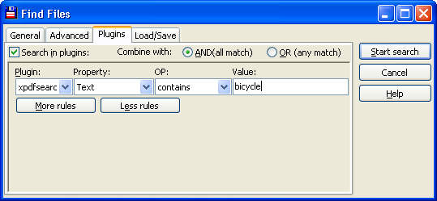
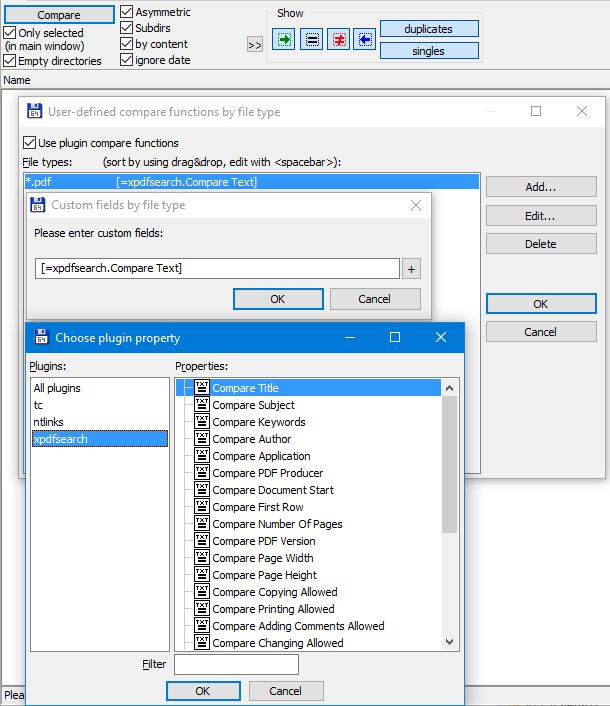

xPDFSearch
==========

xPDFSearch is a content plugin for Total Commander.

Content
-------

1.  [Plugin description](#description)
2.  [Field descriptions](#field_descriptions)
3.  [System requirements](#requirements)
4.  [Use](#use)
5.  [Configuration](#configuration)
6.  [Author contact](#contact)
7.  [License](#license)

1\. Plugin description
----------------------

xPDFSearch can be used to perform full text search in PDF files. In addition xPDFSearch provides meta data information from PDF files. It's possible to display title, subject, keywords, author, application, PDF producer, number of pages, PDF version, created and modified.

Plugin can be used in Synchronize Directories to compare content of PDF files.

2\. Field descriptions
----------------------

<table>
      <tbody>
        <tr>
          <td>Title</td>
          <td>The document tile.</td>
        </tr>
        <tr>
          <td>Subject</td>
          <td>The doucment subject.</td>
        </tr>
        <tr>
          <td>Keywords</td>
          <td>Keywords describing the document.</td>
        </tr>
        <tr>
          <td>Author</td>
          <td>The document author.</td>
        </tr>
        <tr>
          <td>Application</td>
          <td>The application which has been used to create the document.</td>
        </tr>
        <tr>
          <td>PDF Producer</td>
          <td>The component which has been used to perform the conversion to PDF.</td>
        </tr>
        <tr>
          <td>Document Start</td>
          <td>The first approximately 1000 characters of the PDF document.</td>
        </tr>
        <tr>
          <td>First Row</td>
          <td>First row of the PDF document.</td>
        </tr>
        <tr>
          <td>Number Of Pages</td>
          <td>The number of pages of the document.</td>
        </tr>
        <tr>
          <td>PDF Version</td>
          <td>The PDF version of the document.</td>
        </tr>
        <tr>
          <td>Page Width</td>
          <td>The width of the first page.</td>
        </tr>
        <tr>
          <td>Page Height</td>
          <td>The height of the first page.</td>
        </tr>
        <tr>
          <td>Copying Allowed</td>
          <td>Indicates if copying text from the PDF document is allowed.</td>
        </tr>
        <tr>
          <td>Printing Allowed</td>
          <td>Indicates if it's allowed to print the PDF document.</td>
        </tr>
        <tr>
          <td>Adding Comments Allowed</td>
          <td>Indicates if adding comments to the PDF document is allowed.</td>
        </tr>
        <tr>
          <td>Changing Allowed</td>
          <td>Indicates if changing the PDF document is allowed.</td>
        </tr>
        <tr>
          <td>Encrypted</td>
          <td>Indicates if the PDF document is encrypted.</td>
        </tr>
        <tr>
          <td>Tagged</td>
          <td>Indicates if the PDF document is tagged.</td>
        </tr>
        <tr>
          <td>Linearized</td>
          <td>Indicates if the first page of the PDF can be displayed without loading the whole
          file.</td>
        </tr>
        <tr>
          <td>Incremental</td>
          <td>Indicates if the PDF document has been modified by appending data.</td>
        </tr>
        <tr>
          <td>Signature field</td>
          <td>Indicates if the PDF document has Signature field set. This may indicate that the
          document is digitally signed.</td>
        </tr>
        <tr>
          <td>Created</td>
          <td>The creation date of the document.</td>
        </tr>
        <tr>
          <td>Modified</td>
          <td>The date were the document has been modified.</td>
        </tr>
        <tr>
          <td>ID</td>
          <td>The PDF document ID</td>
        </tr>
        <tr>
          <td>PDF Attributes</td>
          <td>
            <table>
              <tbody>
                <tr>
                  <td>PDF indicators displayed as attributes</td>
                </tr>
                <tr>
                  <td>P</td>
                  <td>Printing allowed</td>
                </tr>
                <tr>
                  <td>C</td>
                  <td>Copying allowed</td>
                </tr>
                <tr>
                  <td>M</td>
                  <td>Changing (<b>M</b>odifying) allowed</td>
                </tr>
                <tr>
                  <td>N</td>
                  <td>Adding Comments (<b>N</b>otes) Allowed</td>
                </tr>
                <tr>
                  <td>I</td>
                  <td>Incremental</td>
                </tr>
                <tr>
                  <td>T</td>
                  <td>Tagged</td>
                </tr>
                <tr>
                  <td>L</td>
                  <td>Linearized</td>
                </tr>
                <tr>
                  <td>E</td>
                  <td>Encrypted</td>
                </tr>
                <tr>
                  <td>S</td>
                  <td>Signature</td>
                </tr>
                <tr>
                  <td>O</td>
                  <td>Outlines/Bookmarks</td>
                </tr>
              </tbody>
            </table>
          </td>
        </tr>
        <tr>
          <td>Outlines</td>
          <td>The Outlines (bookmarks) search is available in the search and compare functions of Total Commander.</td>
        </tr>
        <tr>
          <td>Text</td>
          <td>The fulltext search is available in the search and compare functions of Total Commander.</td>
        </tr>
      </tbody>
    </table>

3\. System requirements
-----------------------

You need Total Commander 6.50 or higher for this plugin. To use the Created and Modified fields Total Commander 6.53 or higher is required.

4\. Use
-------

### Start a full text search

1.  In menu click Commands/Search.
2.  Now activate the tab "Plugins".
3.  Select Plugin in the Plugin combobox. The other comboboxes Property (=Text) and OP (=contains) are already set to appropriate values for full text search.
4.  Enter the search text in the value field.
5.  Press start search button.

Of course it's possible to search for the other fields as well.

Search for all PDF documents containing the word bicyle.

The other fields can be additionally used in files by file type, custom columns, tooltips, and thumbnail view.

### Compare two or more files

1.  Open Synchronize Directiories
2.  Click on a small >> button to activate "User-defined compare functions by file type"
3.  Check Use plugin compare functions
4.  Click Add.. to add PDF file type
5.  Specify \*.pdf as file type and click OK
6.  Select xPDFSearch plugin and one of its properties, e.g. Compare Text
7.  Close dialogs with OK, OK, OK
8.  Click Compare

Define xPDFSearch as compare plugin

5\. Configuration
-----------------

xPDFSearch plugin can be configured via TC content plugin ini file.

\[xPDFSearch\]
*   NoCache=0
    *   0=file caching disabled, fast reading of fields, unable to rename or alter attributes of the open PDF file
    *   1=disables file caching, slower reading of fields, allows renaming PDF file with values form xPDFSearch and changing PDF file attributes (not content of PDF file)
*   DiscardInvisibleText=1 discard all invisible characters
*   DiscardDiagonalText=1 discard all text that's not close to 0/90/180/270 degrees
*   DiscardClippedText=1 discard all clipped characters
*   MarginLeft=0 discard all characters left of mediaBox + marginLeft
*   MarginRight=0 discard all characters right of mediaBox - marginRight
*   MarginTop=0 discard all characters above of mediaBox - marginTop
*   MarginBottom=0 discard all characters bellow of mediaBox + marginBottom
*   TextOutputMode=0 text formatting mode:
    *   0=reading order
    *   1=original physical layout
    *   2=simple one-column
    *   3=simple one-column2
    *   4=optimized for tables
    *   5=fixed-pitch/height layout
    *   6=keep text in content stream order

xPDFSearch plugin uses slightly modified [Xpdf library](http://www.xpdfreader.com/about.html). Xpdf can be configured via [xpdfrc file](http://www.xpdfreader.com/xpdfrc-man.html).

6\. Author contact
------------------

There is a [thread](http://www.ghisler.ch/board/viewtopic.php?t=7423) in the [Total Commander forum](http://www.ghisler.ch/) which can be used to discuss problems, bugs and suggestions.

7\. License
-----------

This Total Commander Plugin is licensed under the General Public License (GPL). The license can be found in the file GPL.txt.